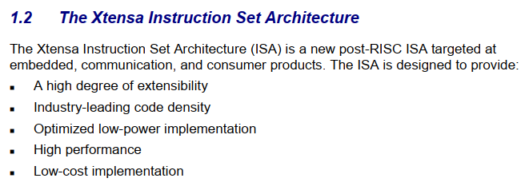
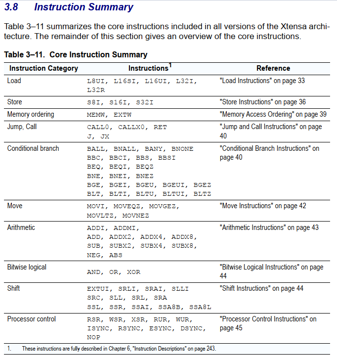
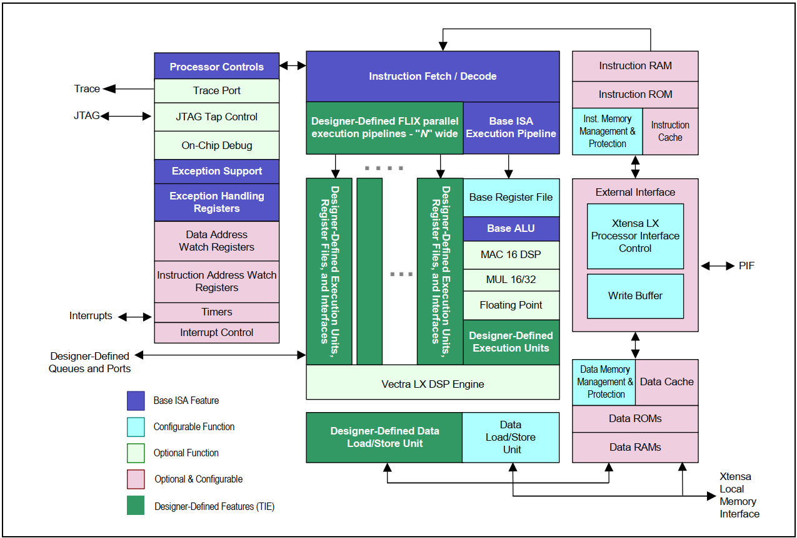
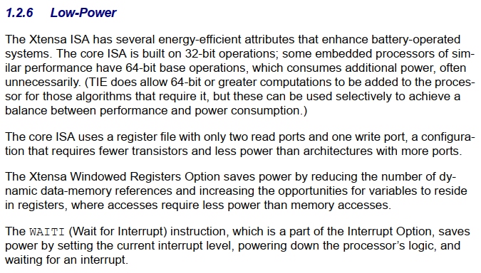
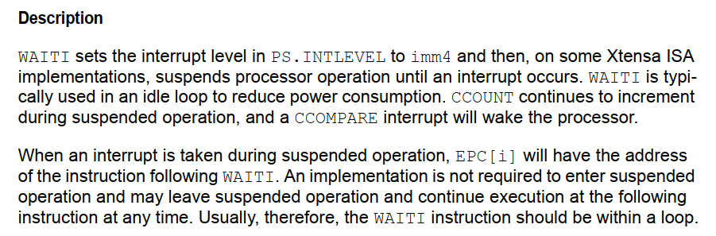
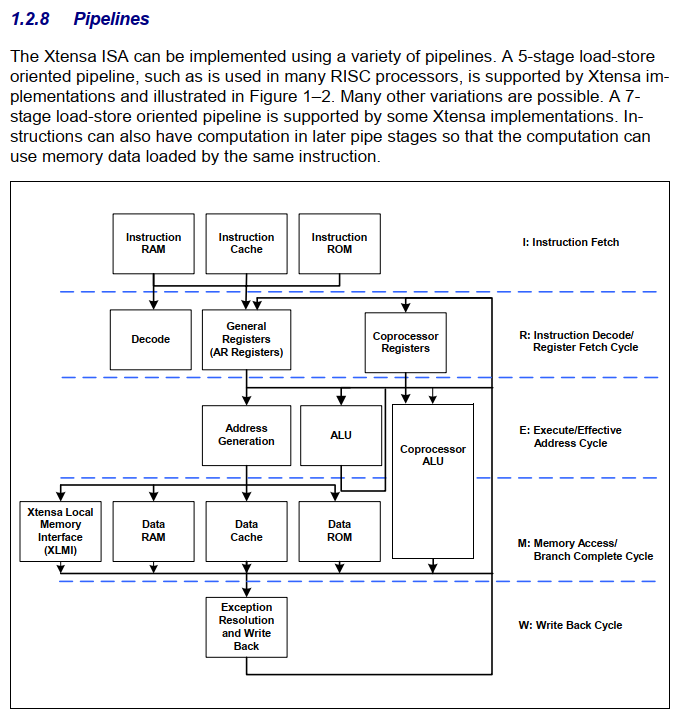

# Equipe 02

Ana Paula Rodrigues Raimundo     - 1862197

João Vitor Santos Anacleto - 1802836

Nilton Miguel Guimaraes de Souza - 2237164

# ISA

a Xtensa ISA é uma arquitetura "moderna pós-RISC" focada na implementação de sistemas embarcados de performance e baixo consumo, como a própria empresa declara:

Obtivemos o documento da ISA no repositório: [xtensa Instruction Set Architecture (ISA) Reference Manual.pdf](https://github.com/eerimoq/hardware-reference/blob/master/esp32/xtensa%20Instruction%20Set%20Architecture%20%28ISA%29%20Reference%20Manual.pdf)

Na versão mais nuclear da ISA estão poucas instruções, sendo a maioria variações de tamanho dos dados transferidos ou qual o mecanismo de offset e shift.

O diagrama de blocos do Hardware que implemente essa ISA. Percebe-se na legenda da imagem o quanto dessas funções são opcionais, ou configuráveis/ inclusas a critério do fabricante do hardware para uma tarefa específica. A Arquitetura é muito adaptável.

# Consumo

Como o foco da ISA é em sistemas embarcados (alimentados a bateria) ela limita a maioria as operações a 32 bit e deixa a possibilidade de extensão a dados maiores para implementações que realmente precisarem.

Além de outras escolhas de design para baixo consumo há a possibilidade de desativar a lógica do processador enquanto se espera por uma interrupção com uma instrução privilegiada.

# Pipelines

Sim, a arquitetura permite pipelines com grau de flexibilidade. A quantidade de estágios varia com a implementação, mas a ISA nos garante suporte a load-store em 5 estágios e até 7 estágios a depender da aplicação.

